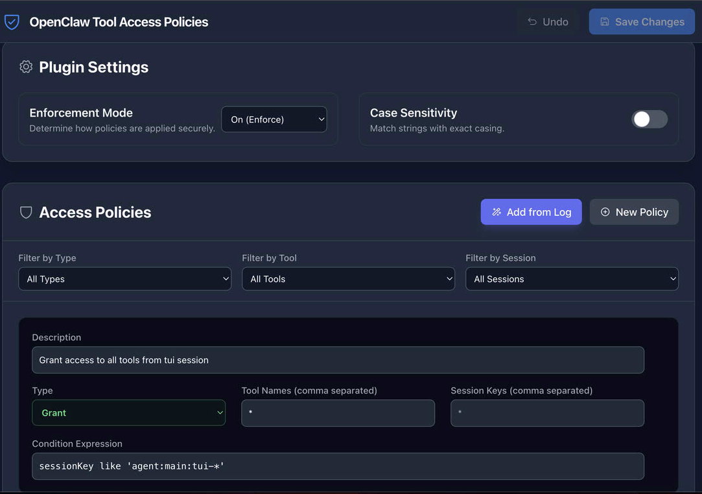
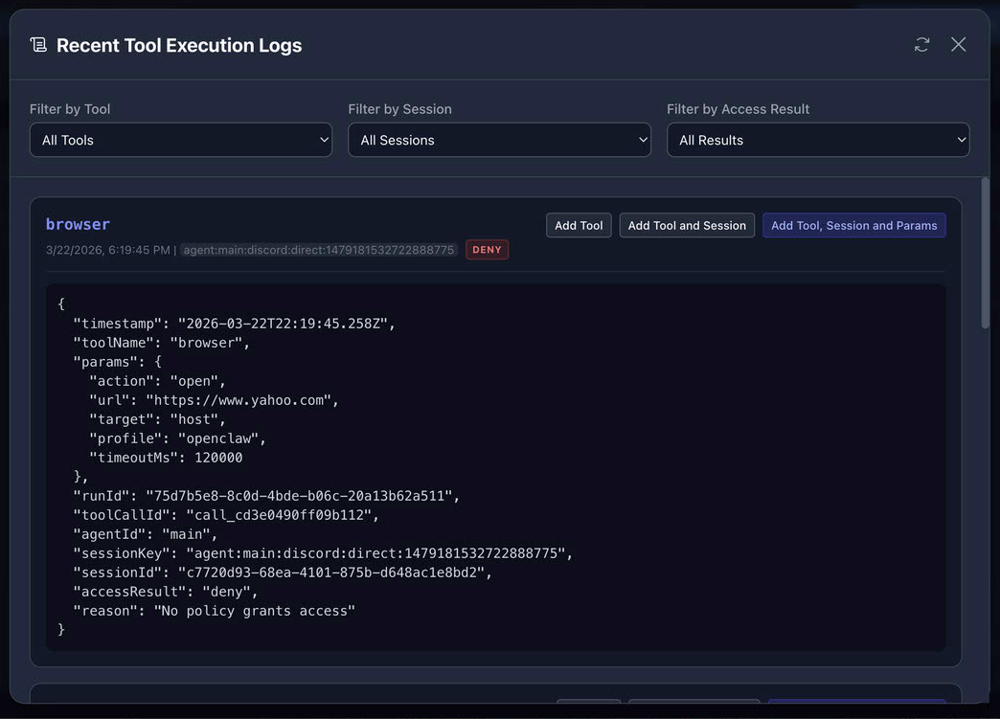

# Fine-Grained Tool Access Control for OpenClaw

Deterministic, robust, and fine-grained access control for your [OpenClaw](https://openclaw.ai) agents. Keep your agents' actions within safe, predefined boundaries at all times.

---

## Why This Plugin?

While prompt-based defenses (system prompts) can guide agent behavior, they are inherently non-deterministic. LLMs might bypass instructions when under pressure or carefully prompted (prompt injection).

**Tools are the bridge between agents and the world.** By implementing **deterministic access control** at the tool level, you create a robust safety layer:
- **Zero Drift**: Decisions are made using hard-coded rules, not LLM reasoning.
- **Deep Inspection**: Inspect not just *which* tool is called, but the exact **parameters** being passed (e.g., specific file paths, URLs, or shell commands).
- **Secure by Default**: Block everything unless explicitly permitted.

OpenClaw itself provides [coarse-grained tool configuration](https://docs.openclaw.ai/tools#tool-configuration) which allows enabling/disabling tools globally or per session. This plugin extends that capability by providing **fine-grained access control**, allowing policies to grant or deny access based on:
- Tool Name
- Session Key / Channel
- **Parameters** (deep inspection of tool arguments)

This plugin uses the `before_tool_call` hook to intercept tool call commands and evaluate policies to allow or deny the execution.
For a tool to be accessible by an agent, it must be permitted by both OpenClaw's global configuration and this plugin's policies. Alternatively, you can set `allow: ["*"]` in OpenClaw and delegate full access control to this plugin.

```json
"tools": {
  "allow": ["*"]
}
```


### Example Policy
```json
    {
      "type": "grant",
      "toolName": ["browser"],
      "sessionKey": ["agent:main:main"],
      "condition": "params.url like 'https://openclaw.ai/*'",
      "desc": "Allow main session to use browser tool for openclaw.ai only"
    },
    {
      "type": "grant",
      "toolName": ["exec"],
      "sessionKey": [],
      "condition": "sessionKey like 'agent:main:tui-*' and params.command match '^(ls|pwd)$'",
      "desc": "Allow TUI to execute safe shell commands"
    },
    {
      "type": "deny",
      "toolName": [
        "edit",
        "write"
      ],
      "sessionKey": [
        "*"
      ],
      "condition": "params.file_path like '*fg-tool-access-control*' or params.path like '*fg-tool-access-control*'",
      "desc": "Deny edit/write fg-tool-access-control plugin files"
    }
```

## Policy Evaluation Logic

The plugin follows a secure-by-default model:
1. **Deny policies are evaluated first**: If any deny policy matches, the tool call is blocked immediately.
2. **Grant policies are evaluated second**: If a match is found, the tool call is permitted.
3. **Implicit Deny**: If no policies match, the tool call is denied.

This logic supports a "Grant everything except…" pattern using deny policies; however, explicit "Grant only…" allow-lists are recommended for higher security.

## Rule Grammar & Operators

The condition field supports a rich set of operators and expressions:

### Relational Operators
- Standard: `<`, `<=`, `>`, `>=`, `==`, `!=`
- String Matching:
  - `match` / `not_match`: Regular expression matching.
  - `contain` / `not_contain`: Simple substring matching.
  - `start_with` / `not_start_with`: Prefix matching.
  - `like` / `not_like`: Pattern matching using `?` (any single character) and `*` (zero or more characters).
- Array/Collection:
  - `in` / `not_in`: Checks if an element exists in an array.

### Logical Operators & Priority
- Operators: `not` > `and` > `or`.
- Use parentheses `( )` to explicitly define evaluation priority.
- Strings must be enclosed in single quotes, e.g., `'xyz'`.

### Built-in Functions
- `length(str)`: Returns string length.
- `substring(str, start, end)`: Returns a substring.
- `now()`: Returns current timestamp.
- `lower(str)` / `upper(str)`: Case conversion.
- `trim(str)`: Removes surrounding whitespace.
- `toString(obj)`: Converts values to string format.

## Configuration & Policy Structure

Configuration is managed in `config.json`:

```json
{
  "mode": "on",
  "port": 8080,
  "caseSensitive": false,
  "policies": [
    {
      "type": "grant",
      "toolName": [
        "*"
      ],
      "sessionKey": [
        "agent:main:main"
      ],
      "condition": "",
      "desc": "Grant access to all tools from main session"
    }
  ]
}
```

### Configuration Fields
- **mode**:
  - `on`: Policies are strictly enforced.
  - `off`: Plugin is inactive.
  - `monitor`: Policies are evaluated and logged, but actions are never blocked. Use this mode to test tool calls in a playground environment before moving to a "production" environment with "on" mode (see details in "Add from Logs").
- **port**: The port for the local Admin UI.
- **caseSensitive**: Set to `true` for exact casing requirements; use `false` (the default) for case-insensitive matching.
- **policies**: An array of policy objects.
  - **toolName**: Array of tool names or `["*"]` or `[]` for all tools.
  - **sessionKey**: Array of session keys or `["*"]` or `[]` for all sessions.
  - **condition**: The logic expression (e.g., `params.command == 'ls' and ...`; `toolName` and `sessionKey` can also be used in the condition, e.g., `sessionKey like 'agent:main:tui-*'`).
  - **desc**: Description of the policy (returned as the reason if blocked).
- The default policy is to grant access to all tools from the main session.

## Installation

1.  **Quick Install**:
    Download `fg-tool-access-control.zip` and run:
    ```bash
    openclaw plugins install <path to fg-tool-access-control.zip>
    ```
    *(Note: If you encounter an "unexpected archive layout" error, unzip the file to a folder and run `openclaw plugins install <path to folder>` instead, or use the Build from Source method below.)*

2.  **Build from Source**:
    Clone the repository to your local machine and run:
    ```bash
    npm install
    npm run build
    openclaw plugins install ./dist
    ```

## Admin UI

You can edit `config.json` directly to change settings and policies, or use the Admin UI.

#### Policy Editor
Manage all your rules with a clean, visual interface:


#### Add from Logs
Instantly create new policies from recent tool execution history:


- **Start UI**: `npm run server` in the plugin folder, normally located at `<openclaw_home>/extensions/fg-tool-access-control` (starts on the port defined in `config.json`).
- **Features**: Edit policies directly, view logs, and create new policies instantly from recent tool execution history.
- **Hot Reload**: The plugin automatically reloads the configuration every 60 seconds.
- **Security**: Shut down the Admin UI when not in use.

## Security Best Practices

### Prefer "Grant" over "Deny"
While deny policies are useful, relying on explicit **grant policies** (Allow-list) is more reliable. Deterministic rules ensure that unexpected LLM outputs never bypass security boundaries.

### Handling LLM Non-determinism
LLMs may generate unexpected parameters that fail strict grant policies (e.g., attempting a file check before a deletion). In such cases:
1. Refine the **condition** using more flexible regular expressions.
2. Provide specific **instructions in the system prompt or skills** so the LLM understands the expected parameter format.

### System Safety
A `system.policy.json` is included by default. It contains critical deny policies to prevent an agent from tampering with the plugin's own configuration. You can add more policies here as you identify specific loopholes. As a rule of thumb, **explicitly enumerate all allowed tools and parameters** for the most secure environment.
